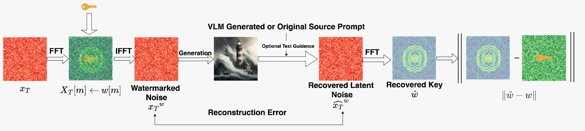
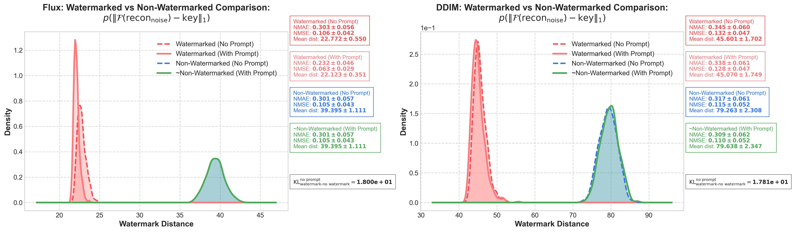
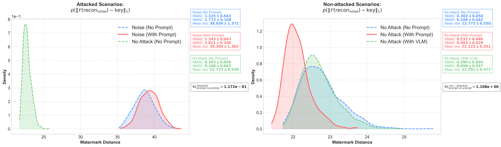
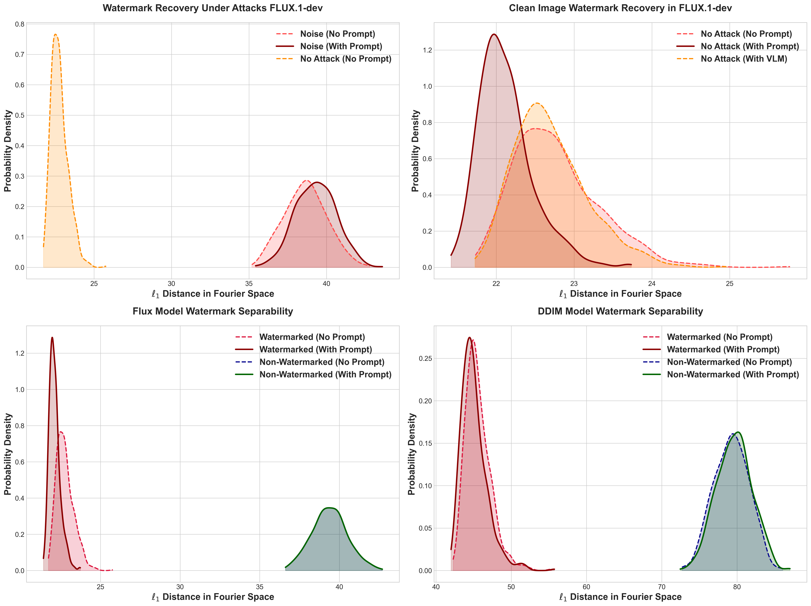

Official Implementation of the paper WMARK@ICLR **Detection Limits and Statistical Separability of Tree Ring Watermarks in Rectified Flow-based Text-to-Image Generation Models.**


## Dataset Release
All the results in the paper can be obtained via the .h5 files given in this link


### Schema of `.h5` files
```
watermark_results_{YYYYMMDD-HHMMSS}_{config_identifier}.h5
├── initial_noise/
│   ├── "0" : Tensor<float32>[channels, height, width]
│   ├── "1" : Tensor<float32>[channels, height, width]
│   └── ...
│
├── generated_images/
│   ├── "0" : Array<uint8>[height, width, 3]
│   ├── "1" : Array<uint8>[height, width, 3]
│   └── ...
│
├── reconstructed_noise/
│   ├── "0" : Tensor<float32>[channels, height, width]
│   ├── "1" : Tensor<float32>[channels, height, width]
│   └── ...
│
├── reconstructed_images/
│   ├── "0" : Array<uint8>[height, width, 3]
│   ├── "1" : Array<uint8>[height, width, 3]
│   └── ...
│
├── watermark_verified : Array<bool>[n_samples]
└── prompts : Array<string>[n_samples]

```
The detailed code to reproduce the results is given in the `evaluate_results.ipynb`


## flux-watermarking






